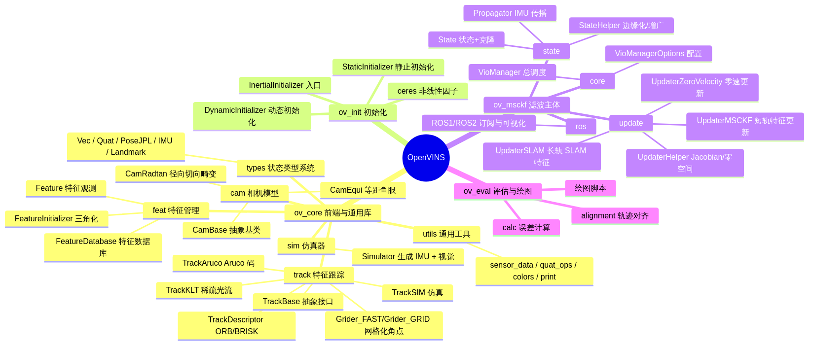
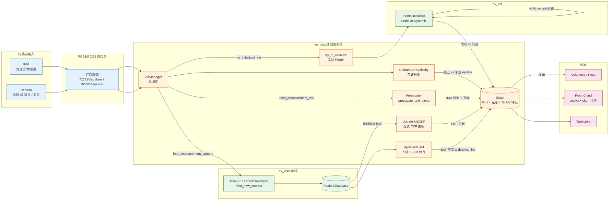

# OpenVINS 中文架构与源码注释

> 本目录 (`docs-cn/`) 是对 [OpenVINS](https://github.com/rpng/open_vins) 项目的中文注释版文档。
>
> 包含:
> - **整体架构思维导图**, 数据流图, 核心流程图 (Mermaid 源码 + 渲染后的 PNG)
> - 对核心文件 (`VioManager / Propagator / UpdaterMSCKF / UpdaterHelper / TrackKLT / InertialInitializer`) 的中文注释
> - **"公式→代码"映射文档**: 把官方英文 docs 里大段数学推导和 C++ 实现一一对应起来 — 看哪个公式卡住了, 直接跳到代码行看是怎么写的
> - 每个子模块的职责, 依赖, 关键函数一览
> - ROS-free 离线回放模式 + 四宫格仪表板使用指南

如果你是第一次接触 VIO/MSCKF, 推荐阅读路径:
1. [`math_foundations.md`](./math_foundations.md) — 先把 JPL 四元数/误差状态/EKF 基础刷一遍 (不懂就回头查公式编号, 全部配了代码行)
2. [`state_and_cov.md`](./state_and_cov.md) — 搞懂状态在内存里怎么排列, 协方差索引怎么算
3. [`propagation_math.md`](./propagation_math.md) — IMU 积分: 连续时间 → 离散时间 Φ, Q_d
4. [`measurement_math.md`](./measurement_math.md) — MSCKF 更新全流程 (投影 / Jacobian / 零空间 / QR / EKF)
5. [`feature_triangulation.md`](./feature_triangulation.md) — 特征如何从像素变成 3D
6. [`online_calibration.md`](./online_calibration.md) — 各种在线标定开关的数学和代码位置
7. [`cross_reference.md`](./cross_reference.md) — **一张大表**: 概念 ↔ 文档章节 ↔ 代码行号的速查索引

已经熟悉 VIO 的话, 直接从 [模块索引](#模块索引) 或 [`cross_reference.md`](./cross_reference.md) 查你关心的部分。

---

## 目录

### 数学原理 + 代码映射 (新增)

| 文档 | 覆盖的公式/概念 | 关键代码 |
| --- | --- | --- |
| [math_foundations.md](./math_foundations.md) | JPL 四元数 / 误差状态 EKF / SO(3) exp&log / FEJ | `ov_type::*`, `ov_core::quat_*`, `skew_x` |
| [state_and_cov.md](./state_and_cov.md) | `_Cov` 内存布局, `Type` 体系, 索引管理 | `State.h`, `StateHelper::augment_clone/marginalize` |
| [propagation_math.md](./propagation_math.md) | IMU 测量模型 / 四元数积分 / F, G, Φ, Q_d | `Propagator::predict_and_compute / predict_mean_discrete / propagate_and_clone` |
| [measurement_math.md](./measurement_math.md) | 像素投影 / H_f, H_x / 零空间 / QR 压缩 / EKF | `UpdaterHelper::get_feature_jacobian_full / nullspace_project_inplace / measurement_compress_inplace`, `UpdaterMSCKF::update` |
| [feature_triangulation.md](./feature_triangulation.md) | DLT / 1D 深度 / 高斯牛顿精化 | `FeatureInitializer::single_triangulation[_1d] / single_gaussnewton` |
| [online_calibration.md](./online_calibration.md) | 相机外参 / 内参 / 时间偏移 / IMU 内参 | `State::_calib_*`, `UpdaterHelper.cpp:404-418` |
| [cross_reference.md](./cross_reference.md) | 概念 ↔ 文档 ↔ 代码行号 速查表 | (索引) |

### 架构总览 + 流程图 (原有)

| 文档 | 内容 | 对应图 |
| --- | --- | --- |
| [architecture.md](./architecture.md) | 整体架构 & 思维导图 & 系统数据流 | `01_architecture_mindmap.png` / `02_system_dataflow.png` |
| [vio_manager.md](./vio_manager.md) | `VioManager` 主循环, 状态结构 | `03_vio_manager_flow.png` / `07_state_structure.png` |
| [tracking.md](./tracking.md) | 视觉前端 (KLT 跟踪 / 描述子 / Aruco) | `04_track_klt_flow.png` |
| [initialization.md](./initialization.md) | 初始化 (静态 vs 动态) | `05_initialization_flow.png` |
| [updater.md](./updater.md) | 更新器 (MSCKF / SLAM / ZUPT) | `06_updater_flow.png` |
| [ros_free.md](./ros_free.md) | ROS-free 离线回放 + 仪表板使用指南 | (见 PR#2) |

Mermaid 源码位于 [`diagrams/*.mmd`](./diagrams)；PNG 位于 [`diagrams/*.png`](./diagrams)。
若需要重新渲染，执行：

```bash
cd docs-cn/diagrams
for f in *.mmd; do
  mmdc -i "$f" -o "${f%.mmd}.png" -p puppeteer.json -w 1800 -H 1400 --backgroundColor white
done
```

---

## 一张图看懂 OpenVINS





> **一句话：** `ov_core` 做前端视觉 + 通用数学；`ov_init` 负责启动时的初值；`ov_msckf` 是 EKF 滤波主体（预测—克隆—更新—边缘化）；`ov_eval` 是离线评估工具。

---

## 模块索引

下面列出的是本次注释重点覆盖的文件：

| 模块 | 文件 | 关键类 / 函数 |
| --- | --- | --- |
| 滤波总调度 | [`ov_msckf/src/core/VioManager.{h,cpp}`](../ov_msckf/src/core/VioManager.cpp) | `VioManager::feed_measurement_imu / feed_measurement_camera / track_image_and_update / do_feature_propagate_update / try_to_initialize` |
| IMU 传播 | [`ov_msckf/src/state/Propagator.{h,cpp}`](../ov_msckf/src/state/Propagator.cpp) | `Propagator::feed_imu / propagate_and_clone / predict_and_compute / select_imu_readings` |
| MSCKF 更新 | [`ov_msckf/src/update/UpdaterMSCKF.{h,cpp}`](../ov_msckf/src/update/UpdaterMSCKF.cpp) | `UpdaterMSCKF::update` + `UpdaterHelper::get_feature_jacobian_full / nullspace_project / measurement_compress` |
| 视觉前端 | [`ov_core/src/track/TrackKLT.{h,cpp}`](../ov_core/src/track/TrackKLT.cpp) | `TrackKLT::feed_new_camera / feed_monocular / feed_stereo / perform_detection_monocular / perform_matching` |
| 初始化 | [`ov_init/src/init/InertialInitializer.{h,cpp}`](../ov_init/src/init/InertialInitializer.cpp) | `InertialInitializer::feed_imu / initialize`（调用 `StaticInitializer` 或 `DynamicInitializer`） |

> 注释风格：在文件头加**总述块**；关键函数前加**算法块注释**；每个"步骤"级别的代码加**行内中文备注**。尽量不改动代码逻辑，只加注释。

---

## 补充阅读

- 官方文档：<https://docs.openvins.com>
- 论文：Geneva et al., *OpenVINS: A Research Platform for Visual-Inertial Estimation*, ICRA 2020
- MSCKF 原始论文：Mourikis & Roumeliotis, *A Multi-State Constraint Kalman Filter for Vision-aided Inertial Navigation*, ICRA 2007

---

> 中文文档由 [Devin](https://devin.ai) 自动生成并由 @gimmijimi 审阅。如与源码不一致，以源码为准。
