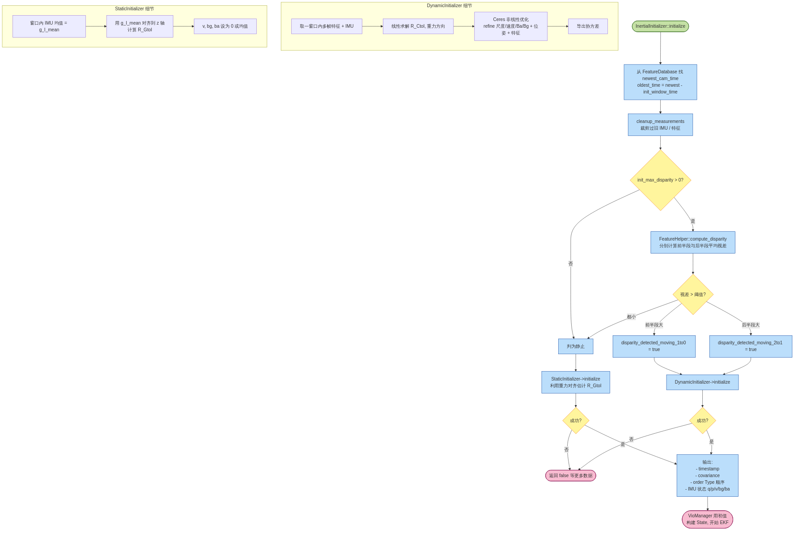

# 04. 初始化

> 本章对应图：`diagrams/05_initialization_flow.png`
>
> 对应源码：`ov_init/src/init/InertialInitializer.{h,cpp}`（已加中文注释）
> 相关：`StaticInitializer`, `DynamicInitializer`, `ceres/*`

## 4.1 为什么初始化很关键

EKF 对初值非常敏感。VIO 必须在开始做滤波之前，提供：

- 重力方向在 IMU 系下的表示 → `q_GtoI`
- IMU 的零偏初值 `bg / ba`
- 速度 `v_IinG`（动态初始化才有）
- 可观的状态协方差，避免过度自信

OpenVINS 提供两种初始化策略，由 `InertialInitializer` 按视差自动选择。

## 4.2 流程图



## 4.3 `InertialInitializer::initialize` 决策

```cpp
bool InertialInitializer::initialize(timestamp, cov, order, t_imu, wait_for_jerk) {
  // 1. 从 FeatureDatabase 找 newest_cam_time; oldest_time = newest - init_window_time
  // 2. cleanup_measurements / 丢弃过老 IMU
  // 3. 用 FeatureHelper::compute_disparity 计算前半段/后半段平均视差
  //    - 若两段都小 -> 判为静止 -> 走 StaticInitializer
  //    - 否则 -> 走 DynamicInitializer
  // 4. 返回 timestamp, cov, order, t_imu
}
```

几个参数直接影响策略选择：

| 参数 | 含义 |
| --- | --- |
| `init_window_time` | 初始化窗口长度（秒），典型 1.0 ~ 2.0 |
| `init_max_disparity` | 视差阈值，超过表示有激励 |
| `init_imu_thresh` | 静止判据：IMU 加速度方差阈值 |
| `init_dyn_use` | 是否允许 DynamicInitializer |
| `wait_for_jerk` | true 则必须检测到"拿起"动作才初始化 |

## 4.4 `StaticInitializer`（静止初始化）

假设设备**完全静止**：

1. 取窗口内所有 IMU，计算加速度 / 角速度均值
2. `g_I_mean = mean(acc)` 视作重力投影在 IMU 坐标下的表示
3. 把 `g_I_mean` 对齐到世界系 `z` 轴 → 得到 `R_GtoI`
4. `bg = mean(gyro)`（静止时陀螺输出应 ≈ 0 → 把均值当零偏）
5. `ba = mean(acc) - R_GtoI * [0,0,g]^T`
6. `v = 0`

**协方差**：
- 姿态 roll/pitch 由加速度均值的方差决定
- yaw 不可观 → 设一个较大先验
- `bg, ba` 由 IMU 白噪声推导

优点：计算快。缺点：无尺度信息；在静止时才可用。

## 4.5 `DynamicInitializer`（动态初始化）

当设备被激励（晃动、走动）时启用，核心思路是 *Dong-Si 2012 IEEE IROS*：

### 阶段 A：线性求解

收集窗口内的视觉 + IMU：

1. 利用两帧之间的视觉对应做**五点法 / 单应**求相对位姿（不可观尺度）
2. 用 IMU 预积分的位置/速度 与视觉位移 联立，解出：
   - 重力方向 `g_I`（向量）
   - 尺度 `s`
   - 每帧速度 `v_k`
   - 相机 - IMU 外参 `R_CtoI`（如果未标定）

得到一个闭式近似解。

### 阶段 B：Ceres 非线性 refine

用 Ceres 把前端给出的**所有视觉观测 + IMU 预积分**放进一个 BA-like 问题：

- **变量**：每帧位姿（四元数 + 位置）、速度、`bg`, `ba`、重力方向、所有路标 3D 位置、外参
- **因子**：
  - 视觉重投影残差（每个特征在每帧的 uv 误差）
  - IMU 预积分残差（Forster 2016）
  - bias 随机游走 先验
  - 重力大小约束（`|g| = 9.81`）
- **求解**：Levenberg-Marquardt，多次迭代；雅可比用 Ceres 自动求导 + 少量自定义 Cost

完成后：

1. 从 Ceres 的 `Covariance` 工具导出**初始协方差块**
2. 按 `Type` 顺序组织 `order`，返回给 `VioManager`

### 阶段 C：交接给 `VioManager`

```cpp
VioManager 接到 initializer 返回的 (timestamp, cov, order, t_imu):
  state->_imu = t_imu;                              // 复制 IMU 状态
  state->set_initial_covariance(cov, order);         // 覆盖协方差对角块
  // 把 init 期间的视觉观测作为首批特征进入 feats_slam_DELAYED
  is_initialized_vio = true;
```

之后 EKF 就接管一切。

## 4.6 何时会失败？

- 视差不足（纯旋转 / 前向运动） → 动态初始化解不出尺度 → 返回 `false`
- 视觉特征太少（`< feat_thresh`） → `compute_disparity` 返回 `false`
- Ceres 优化不收敛或协方差奇异 → 返回 `false`
- Android 平台 `#ifndef __ANDROID__`：没有编译 `DynamicInitializer`，只能用静态

失败时 `VioManager::try_to_initialize` 会继续等下一批数据再重试。

## 4.7 使用建议

- 机器人起步前摆一会儿 **(1~2 s 静止)** → 利用静态初始化拿到稳定的 `bg, ba, R_GtoI`
- 手持设备 → 稍微画几个圈，让动态初始化收敛
- 如果需要 "想开机就能用"，可把 `wait_for_jerk=false`

---

上一章：[视觉前端](./tracking.md) ｜ 下一章：[更新器](./updater.md)
