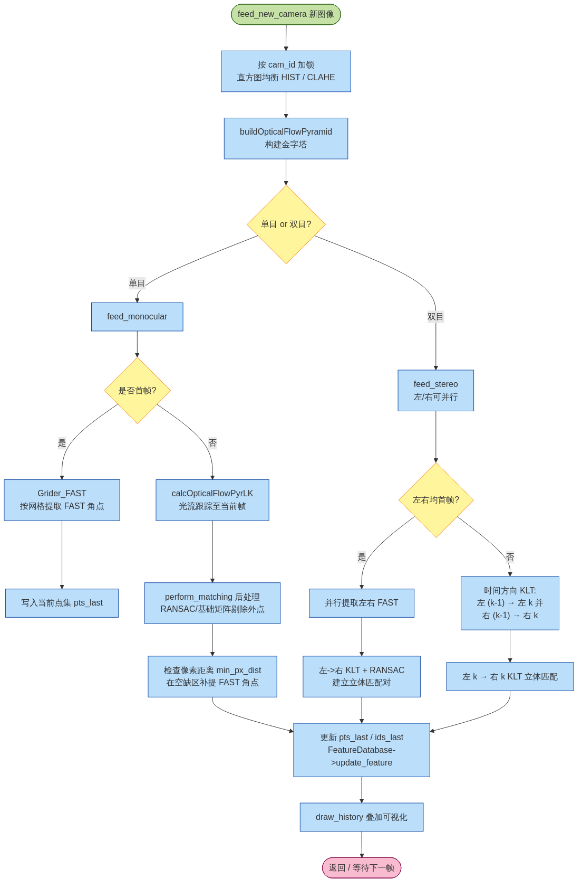

# 03. 视觉前端 / KLT 跟踪

> 本章对应图：`diagrams/04_track_klt_flow.png`
>
> 对应源码：`ov_core/src/track/TrackKLT.{h,cpp}`（已加中文注释）
> 相关：`TrackBase`, `TrackDescriptor`, `TrackAruco`, `Grider_FAST`, `Grider_GRID`, `FeatureDatabase`

## 3.1 TrackBase 抽象接口

所有前端都继承 `TrackBase`，统一提供：

```cpp
virtual void feed_new_camera(const CameraData &message) = 0;
std::shared_ptr<FeatureDatabase> get_feature_database();
cv::Mat get_last_image(int cam_id);
void display_active(cv::Mat &img_out, ...);
```

已实现：

| 类 | 原理 | 适用场景 |
| --- | --- | --- |
| `TrackKLT` | 金字塔 Lucas-Kanade 光流 + FAST 角点 + RANSAC | **默认**，速度快，纹理丰富时效果好 |
| `TrackDescriptor` | ORB / BRISK / 描述子匹配 + knn_ratio | 强光照变化、宽基线 |
| `TrackAruco` | OpenCV Aruco 码检测 | 先验场景（如标定板），可与其他并存 |
| `TrackSIM` | 直接塞入仿真器给出的 `(id, uv)` | 仿真 |

## 3.2 TrackKLT 主流程



### 入口 `feed_new_camera`

```cpp
void TrackKLT::feed_new_camera(const CameraData &message) {
  // 1. 预处理（直方图均衡 + 构建金字塔）——串行，按 cam_id 加锁
  // 2. 根据相机数量分发到 feed_monocular / feed_stereo
}
```

**预处理选项：**
- `HistogramMethod::HISTOGRAM` → `cv::equalizeHist`
- `HistogramMethod::CLAHE` → `cv::createCLAHE(10.0, cv::Size(8,8))`
- `HistogramMethod::NONE` → 直接用原图

**金字塔：** `cv::buildOpticalFlowPyramid(img, imgpyr, win_size, pyr_levels)`，`win_size` 默认 `cv::Size(15, 15)`，`pyr_levels` 默认 5。

### 单目 `feed_monocular`

流程：

1. **首帧** → `Grider_FAST::perform_griding` 按网格提取 FAST 角点（保证空间分布均匀）
2. **非首帧** → `cv::calcOpticalFlowPyrLK` 把上一帧的特征点跟到当前帧
3. `perform_matching` 过滤：
   - 反向光流（当前→上一帧）一致性检查
   - 基于基础矩阵 `cv::findFundamentalMat(.., FM_RANSAC)` 剔除外点
4. 根据 `min_px_dist` 参数在"空缺网格"里**补提**新角点（保持特征总数 `≈ numfeats`）
5. 把每个点的 `(cam_id, time, uv)` 写进 `FeatureDatabase`

### 双目 `feed_stereo`

分"时间方向"和"立体方向"两个 KLT，两者叠加：

```
上一帧左 ────时间方向 KLT───▶ 当前帧左
                                     │
                                     ▼
                          立体方向 KLT (当前帧左 → 当前帧右)
                                     ▲
                                     │
上一帧右 ────时间方向 KLT───▶ 当前帧右
```

两次 RANSAC：一次做时间方向，一次做左右相机之间，保证：
- 两个相机看到同一个路标得到**同一个 `feat_id`**
- 过滤三角化不一致的点

### 网格化提取 `Grider_FAST`

参数 `grid_x`, `grid_y`（默认 5×5）把图像划为若干 cell，每个 cell 单独提取 FAST，取 top-N。好处：**特征分布均匀**，避免所有特征挤在一小块纹理区。

## 3.3 FeatureDatabase

`FeatureDatabase` 是前端和后端的桥梁：

```cpp
struct Feature {
  size_t featid;
  std::unordered_map<size_t, std::vector<double>> timestamps;          // cam_id -> 时间列表
  std::unordered_map<size_t, std::vector<Eigen::VectorXf>> uvs;        // 像素坐标
  std::unordered_map<size_t, std::vector<Eigen::VectorXf>> uvs_norm;   // 归一化坐标
  Eigen::Vector3d p_FinG;                                              // 三角化后的世界点（可选）
  bool to_delete = false;                                              // 已被使用/决定丢弃
};
```

常用查询：

| API | 含义 |
| --- | --- |
| `update_feature(id, ts, cam, uv, uv_n)` | 追加一次观测 |
| `features_containing(ts, ..., remove)` | 找出在时间 `ts` 上有观测的所有特征 |
| `features_not_containing_newer(ts, ..., remove)` | 找出在 `ts` 之后没有观测（即"跟丢"）的特征 |
| `cleanup_measurements(oldest)` | 把比 `oldest` 更老的观测整体删除 |

`VioManager::do_feature_propagate_update` 会根据这些查询把特征分为 `feats_lost / feats_marg / feats_slam` 三路。

## 3.4 性能要点

- **并行**：`feed_stereo` 中左右相机可以并行 KLT；`TrackKLT` 在 `feed_new_camera` 里用 `ov_core::ParallelBody` 把跨相机的预处理派发到多线程
- **图像直方图均衡**：夜晚/HDR 场景 `CLAHE` 比 `equalizeHist` 稳定
- **`min_px_dist`**：两特征最近像素距离。偏小则特征密集但冗余；偏大则可能过早跟丢

---

上一章：[VioManager 主流程](./vio_manager.md) ｜ 下一章：[初始化](./initialization.md)
