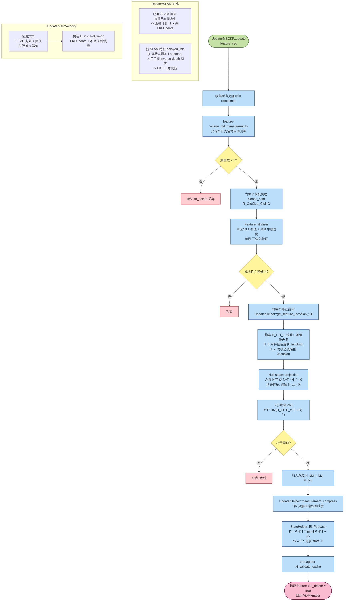

# 05. 更新器（MSCKF / SLAM / ZUPT）

> 本章对应图：`diagrams/06_updater_flow.png`
>
> 对应源码：`ov_msckf/src/update/UpdaterMSCKF.{h,cpp}`（已加中文注释）
> 相关：`UpdaterSLAM`, `UpdaterZeroVelocity`, `UpdaterHelper`

## 5.1 三个更新器的分工

| 更新器 | 特征类别 | 状态里有特征吗？ | 用途 |
| --- | --- | --- | --- |
| `UpdaterMSCKF` | 短轨迹（跟丢 / 被边缘化 / 达 max_clone 的非 SLAM） | **不存** | 多状态约束更新：把所有克隆的观测堆成一个大残差 |
| `UpdaterSLAM` | 长轨迹（已晋升 SLAM） | **存** | 直接对 SLAM 特征状态做 EKFUpdate；新特征走 `delayed_init` |
| `UpdaterZeroVelocity` | 无特征 | — | 静止时的零速约束（`v=0, w=bg`） |

MSCKF 的巧妙之处：**特征不进状态**，通过 Jacobian 的左零空间投影把特征的维度消掉，只留下与克隆位姿相关的残差。——省内存、维持状态大小。

## 5.2 流程图



## 5.3 `UpdaterMSCKF::update` 详解

### Step 0 — 合法性筛选

```cpp
for each feature in feature_vec:
  feature->clean_old_measurements(clonetimes);   // 只保留有克隆的观测时间
  if 测量数 < 2: 丢弃
```

### Step 1 — 构造每相机的克隆位姿

```cpp
for each camera cam_id in _calib_IMUtoCAM:
  for each clone t in _clones_IMU:
    R_GtoCi = R_ItoCi * R_GtoIi
    p_CioinG = p_IioinG - R_GtoCi^T * p_IinC
    clones_cam[cam_id][t] = (R_GtoCi, p_CioinG)
```

这些位姿供三角化和 Jacobian 构建使用。

### Step 2 — 三角化

`FeatureInitializer` 对每个特征：
1. 用第一个克隆做 anchor，DLT 求初值
2. 高斯牛顿非线性 refine 使得重投影误差最小
3. 视锥检查（特征必须在每个观测相机的前方）

失败的特征丢弃。

### Step 3 — 每特征的 Jacobian 与零空间投影

核心：`UpdaterHelper::get_feature_jacobian_full`

对每次观测 `uv_ij`（第 i 帧第 j 个相机）：

$$
\tilde{z}_{ij} = z_{ij} - h(\mathbf{X}, \mathbf{p}_F) \quad\approx\quad \mathbf{H}_{x,ij} \, \tilde{\mathbf{X}} + \mathbf{H}_{f,ij} \, \tilde{\mathbf{p}}_F + \mathbf{n}_{ij}
$$

把一个特征的所有观测堆成 `[H_x; H_f; r]`，然后：

```cpp
UpdaterHelper::nullspace_project_inplace(H_f, H_x, r);
```

左乘 `H_f` 的**左零空间** `N^T`（数值上用 `H_f` 的 SVD / `JacobiSVD`），使得 `N^T H_f = 0`，最终：

$$
\mathbf{r}' = N^T \mathbf{r},\quad \mathbf{H}'_x = N^T \mathbf{H}_x,\quad \mathbf{R}' = N^T \mathbf{R} N \approx \sigma^2 \mathbf{I}
$$

特征 `p_F` 的影响被消掉，**残差只与状态有关**。

### Step 4 — 卡方检验剔除外点

```cpp
double gamma = r'^T * (H' P H'^T + R')^{-1} * r';
if (gamma > chi_squared_table[dim])  // 卡方 95% 分位
  drop feature as outlier;
```

`chi_squared_table` 在构造函数里预计算好 1~499 维的阈值。

### Step 5 — 聚合与压缩

把所有保留下来的特征的 `H'_x, r'` 堆起来：

```cpp
H_big = [H'_x(feat1); H'_x(feat2); ...]
r_big = [r'(feat1);   r'(feat2);   ...]
```

维度可能非常高（O(特征数 × 克隆数)）。`UpdaterHelper::measurement_compress_inplace` 用 **QR 分解** 把 `H_big` 压缩成上三角：

```
H_big = Q * [R_u; 0]     (R_u 上三角)
 ==> 有效残差 = Q^T r_big 的前 rank 行
```

压缩后维度从 `O(meas)` 降到 `O(state)`，加速后续 EKFUpdate。

### Step 6 — `StateHelper::EKFUpdate`

标准 EKF：

$$
K = P H'^T (H' P H'^T + R')^{-1},\quad \delta\mathbf{X} = K \mathbf{r}',\quad P = (I - K H') P
$$

并对 `_imu` 的四元数等 **流形变量** 用 `boxplus` 更新。

### Step 7 — 收尾

- `propagator->invalidate_cache()`：缓存失效，下一次 `propagate_and_clone` 不能复用旧的 Phi/Q
- 特征 `to_delete = true`：通知 `FeatureDatabase` 删除

## 5.4 `UpdaterSLAM`

分两种情况：

### (a) `update(state, feats_slam_UPDATE)` —— 已有 SLAM 特征

这些特征**已在状态中**（`state->_features_SLAM`）。步骤：
- 构建 `H_x`（包含 IMU 克隆 + 该特征本身的 Jacobian）
- 不需要零空间投影（特征本来就是状态变量）
- 卡方检验 → `EKFUpdate`

### (b) `delayed_init(state, feats_slam_DELAYED)` —— 新 SLAM 特征

- 先三角化得到初值 `p_F`
- 用 `StateHelper::initialize` / `initialize_invertible`：
  - 用测量 Jacobian `H` 做线性一步 update
  - 同时把新的 `Landmark` 类型追加进 `_features_SLAM` 和协方差
- SLAM 特征可用 **XYZ** 或 **单特征逆深度** 表示，由 `feat_rep_slam` 选项决定

## 5.5 `UpdaterZeroVelocity`

典型实现：

```cpp
bool try_update(state, timestamp) {
  // 1. 检查 IMU 方差 / 视差，判断是否静止
  // 2. 若静止：构造 r = [v; w - bg]，H 把对应行挑出来
  // 3. 卡方检验 + EKFUpdate，但 *不做 propagate_and_clone*
  // 4. 返回 true 让 VioManager 直接跳过本帧的传播
}
```

在启动阶段 (`zupt_only_at_beginning`) 特别有用：汽车、无人机启动前停着不动时，零速约束能快速把 `bg, ba` 拉准。

## 5.6 代码调用关系

```
VioManager::do_feature_propagate_update
   └─ updaterMSCKF->update
         ├─ FeatureInitializer::triangulate          (三角化)
         ├─ UpdaterHelper::get_feature_jacobian_full (建 H_x, H_f, r)
         ├─ UpdaterHelper::nullspace_project_inplace (零空间投影)
         ├─ chi2 检验
         ├─ UpdaterHelper::measurement_compress_inplace (QR 压缩)
         └─ StateHelper::EKFUpdate
   └─ updaterSLAM->update / delayed_init
         └─ （类似，但不做零空间）
   └─ updaterZUPT->try_update
```

---

上一章：[初始化](./initialization.md) ｜ 回到：[README](./README.md)
