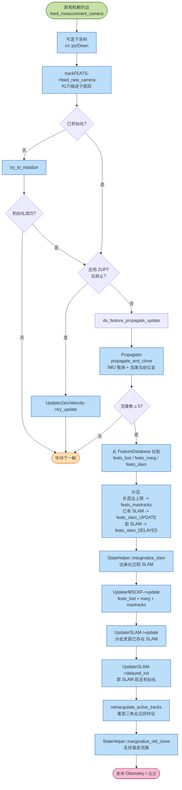
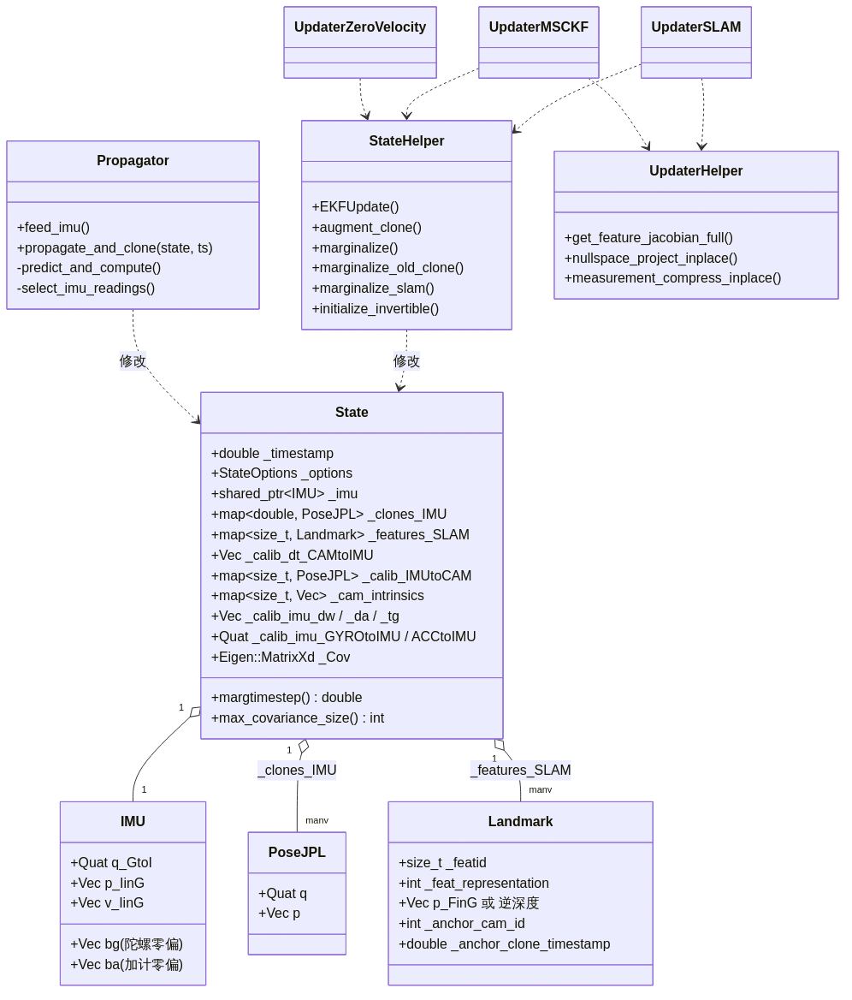

# 02. VioManager 主流程

> 本章对应图：`diagrams/03_vio_manager_flow.png`，`diagrams/07_state_structure.png`
>
> 对应源码：`ov_msckf/src/core/VioManager.{h,cpp}`（已加中文注释）

## 2.1 职责

`VioManager` 是整个 VIO 系统的 **总调度**：

- 持有 `State`（状态）、`Propagator`（传播）、`trackFEATS`（前端）、`initializer`（初始化）、`updaterMSCKF/SLAM/ZUPT`（更新器）
- 对外暴露三个入口：
  - `feed_measurement_imu(ImuData)` —— IMU 数据灌入
  - `feed_measurement_camera(CameraData)` —— 真实相机图像
  - `feed_measurement_simulation(ts, camids, feats)` —— 仿真模式下的合成特征

## 2.2 主流程图



## 2.3 逐步讲解

### (a) `feed_measurement_imu`

```cpp
void VioManager::feed_measurement_imu(const ov_core::ImuData &message) {
  double oldest_time = ...;            // 计算可以丢弃的 IMU 最早时间
  propagator->feed_imu(message, oldest_time);
  if (!is_initialized_vio)
    initializer->feed_imu(message, oldest_time);
  if (is_initialized_vio && updaterZUPT != nullptr && ...)
    updaterZUPT->feed_imu(message, oldest_time);
}
```

- **`oldest_time`** 的作用：让 `Propagator` / `Initializer` / `ZUPT` 自己裁剪过旧的 IMU，避免内存一直涨。
- 初始化阶段 `oldest_time` 取 `message.timestamp - init_window_time`，确保窗口内数据保留。

### (b) `track_image_and_update`

相机输入的总入口：

1. **下采样**（可选）：`cv::pyrDown`
2. **前端跟踪**：`trackFEATS->feed_new_camera(message)` —— KLT 或描述子匹配
3. **ZUPT 检测**：若启用且满足静止条件，调用 `updaterZUPT->try_update` 做零速 EKF 更新，然后直接返回
4. **初始化分支**：若 `!is_initialized_vio`，调用 `try_to_initialize(message)`，失败则 `return` 等下一帧
5. **滤波主流程**：`do_feature_propagate_update(message)`

### (c) `try_to_initialize`

真实工作交给 `InertialInitializer::initialize`。初始化**可能在另一线程**异步执行：

- `thread_init_running` / `thread_init_success` 是原子标记，主线程仅负责触发 / 轮询结果
- 成功后用 `initializer` 返回的 `timestamp, covariance, order, t_imu` 构造 `State`，并把 `is_initialized_vio` 置 `true`

详见 [initialization.md](./initialization.md)。

### (d) `do_feature_propagate_update`

这是最核心的一段，可以拆成 **四步走**：

#### Step 1 — 传播 + 克隆

```cpp
propagator->propagate_and_clone(state, message.timestamp);
```

- 使用 `Propagator` 收集 `(state->_timestamp, message.timestamp]` 区间的 IMU
- 用 4 阶 RK / 离散积分把 IMU 部分的均值和协方差推到新时刻
- 同时在 `state->_clones_IMU` 里**增广**一份新位姿（深拷贝 `q_GtoI, p_IinG`）

#### Step 2 — 从 FeatureDatabase 拉特征 & 分类

```cpp
feats_lost    = db->features_not_containing_newer(state->_timestamp, false, true);
feats_marg    = db->features_containing(state->margtimestep(), false, true);
// 再按规则搬移：
//  - feats_marg 里轨迹达到 max_clone_size 的 -> feats_maxtracks
//  - 已经是 SLAM 特征 -> feats_slam_UPDATE
//  - 新 SLAM 候选   -> feats_slam_DELAYED
```

| 类别 | 含义 | 用途 |
| --- | --- | --- |
| `feats_lost` | 在当前帧丢失的特征 | MSCKF 更新 |
| `feats_marg` | 要随 oldest 克隆被边缘化的特征 | MSCKF 更新 |
| `feats_maxtracks` | 轨迹很长但没被选为 SLAM 的 | MSCKF 更新 |
| `feats_slam_UPDATE` | 状态中已存在的 SLAM 特征 | SLAM 更新 |
| `feats_slam_DELAYED` | 要新增到状态的 SLAM 候选 | SLAM delayed_init |

#### Step 3 — 更新

```cpp
StateHelper::marginalize_slam(state);
updaterMSCKF->update(state, featsup_MSCKF);
updaterSLAM->update(state, feats_slam_UPDATE);
updaterSLAM->delayed_init(state, feats_slam_DELAYED);
```

详见 [updater.md](./updater.md)。

#### Step 4 — 可视化 + 边缘化旧克隆

```cpp
retriangulate_active_tracks(message);        // 为下游（回环）重新三角化
StateHelper::marginalize_old_clone(state);   // 保持滑窗大小
```

## 2.4 状态结构



- `State::_clones_IMU` 是一个 `std::map<double, shared_ptr<PoseJPL>>`，`key` 是时间戳（升序，最老 = `begin()`）
- `State::margtimestep()` 返回 `_clones_IMU.begin()->first`，即最老克隆的时间
- `State::max_covariance_size()` 返回当前协方差总维度（会随 SLAM 特征增减）

## 2.5 线程 / 并发

`VioManager` 内部没有自己的线程池，但：

- `try_to_initialize` 允许以异步方式执行；`thread_init_running` 保证同一时刻只有一个初始化任务
- ROS 层（`ROS1Visualizer`）常见做法：IMU 回调高频直接进 `feed_measurement_imu`（只落入队列），图像回调低频触发 `feed_measurement_camera`

---

上一章：[整体架构](./architecture.md) ｜ 下一章：[视觉前端 / KLT 跟踪](./tracking.md)
