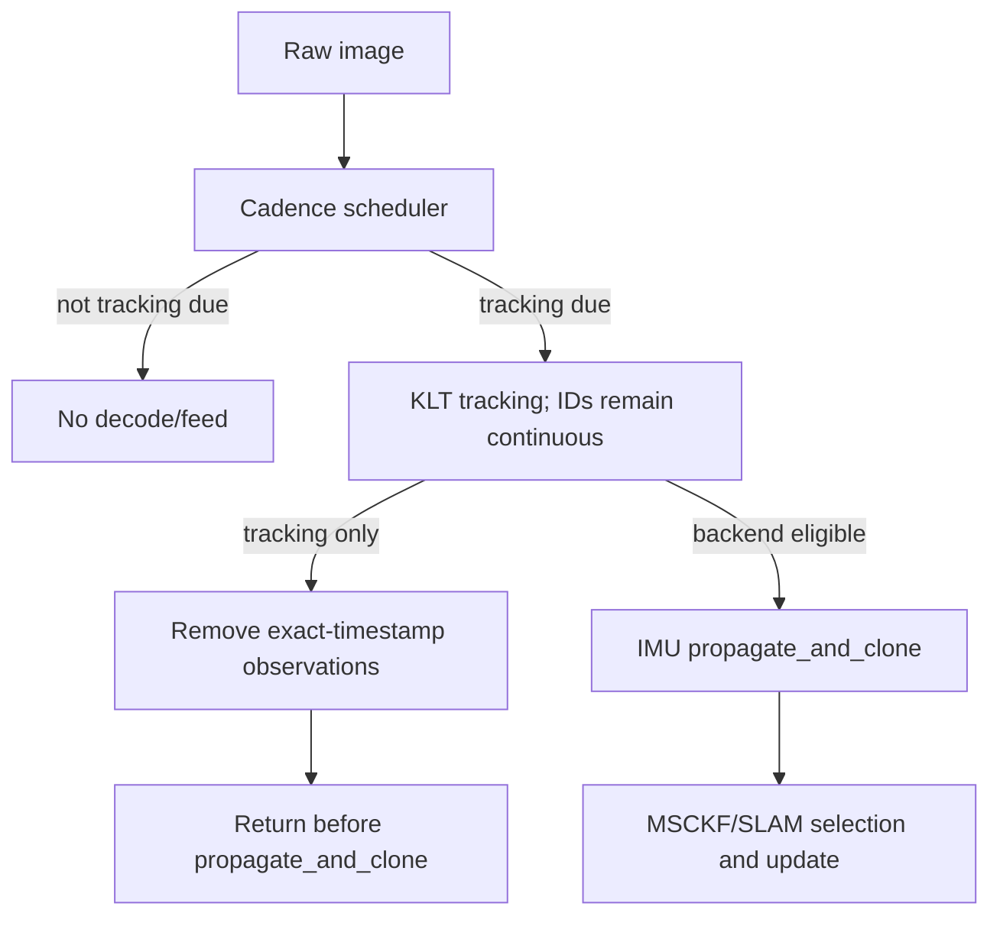

# P5 Frontend/Backend Cadence Contract

## Definitions

- A **raw frame** is every dataset camera timestamp available to the runner.
- A **tracking frame** is admitted to the KLT frontend and updates tracker
  images, feature IDs, and frontend health.
- A **backend frame** is a tracking frame that also propagates/augments an IMU
  clone and is eligible for MSCKF/SLAM visual updates.
- A **tracking-only frame** is tracked but is not backend eligible.

The invariants are:

```text
tracking_stride <= backend_update_stride
backend_frame => tracking_frame
tracking_only_frame => no clone at its timestamp
tracking_only_observation => absent from FeatureDatabase after tracking
```

## Runtime path



The normal `feed_measurement_camera(message)` API remains backend eligible for
all existing callers. P5 uses an explicit backend-eligibility API. The
tracking-only branch executes after KLT and after the P4 alignment supervisor
has consumed its own immutable frame snapshot, but before any clone creation.

## Feature lifecycle

KLT owns feature-ID continuity across every tracking frame. The frontend writes
the current observation to `FeatureDatabase` as usual. On a tracking-only
frame, P5 removes exactly that timestamp from the normal and ArUco databases.
Features with older backend-eligible observations remain alive and retain the
same IDs; features born only on a tracking-only frame may remain in KLT but have
no backend observation until a later backend frame.

Consequently, MSCKF sees a sparse observation sequence whose timestamps all
have corresponding clones. Intermediate pixels improve KLT continuity but do
not create false clone observations.

## Scheduling

Separate raw-frame counters are maintained since the last tracking and backend
frames. If a backend frame becomes due, tracking is forced even if its tracking
counter is not due. State transitions publish both targets atomically. A safety
downshift can make the next raw frame due immediately; recovery changes both
targets once after the state recovery dwell.

Before P4 online initialization releases navigation, the registered fixed
initialization stride remains in force so P4 behavior is not modified. P5
state-machine cadence starts only after OpenVINS is initialized.

## Runtime proof fields

The audit log records raw timestamp, policy state, both target strides,
tracking/backend decisions, time and frame gaps since each accepted frame,
tracking-only observation removals, clone count before/after tracking-only
frames, feature-ID continuity, MSCKF health, residual health, and covariance
health. Acceptance requires zero tracking-only clone violations and zero
backend observations at tracking-only timestamps.

## Dashboard independence

`--no-display` hides the OpenCV window but intentionally retains Dashboard
data preparation and canvas rendering. Deployment/realtime screening uses
`--no-dashboard`, which additionally skips display-only alignment, historical
track-image construction, Dashboard updates/rendering, and cloned KLT image
payloads.

The lightweight tracker packet remains active with `--no-dashboard`. It still
contains image dimensions, accepted current/previous points, feature IDs,
timestamps, parallax inputs, and diagnostic counters. Therefore Dashboard
shutdown cannot change the P5 state, tracking/backend targets, or estimator
observations. The registered fly1/fly3 ablation confirmed identical policy
cadence and sub-millimetre trajectory differences across Dashboard modes.
