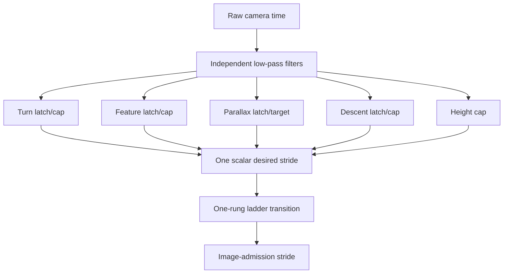

# P5 Causal Adaptive Stride Policy State Machine

## Scope

This document freezes the P5 controller contract before implementation. P4,
the June-12 camera calibration, fixed Camera--IMU `T_C_I`, and the navigation
evaluation contract are unchanged. GPS horizontal position/course, offline
trajectory error, approximately 7-degree/4.089-degree corrections, repair,
restart, anchor reset, and time-varying flex correction are forbidden inputs.

## Audited legacy control flow

The legacy controller updates independent latches for turn, feature count,
parallax, descent, and height. Each latch modifies one scalar desired stride.
It then moves only one rung on `{1,2,4,6,8,12}` after 0.5 s downward or 5 s
upward dwell.

Observed consequences in the registered fly1/fly3 active windows:

| Flight | Commands | Median command interval | Same-state reversal within 10 s | Approximately 5 s upward rungs |
| --- | ---: | ---: | ---: | ---: |
| fly1 | 30 | 5.002 s | 6 | 12 |
| fly3 | 49 | 5.001 s | 4 | 21 |

The estimator covariance and feature-count gates remained healthy. The
rejection was caused by competing latches and rung-by-rung recovery, not by
estimator divergence.

## New single-state contract

Exactly one state is active. Priority is ordered from most safety-critical to
least safety-critical:

1. `VISUAL_DEGRADED`
2. `LOW_ALTITUDE_SAFETY`
3. `TURN_SAFETY`
4. `DESCENT_SAFETY`
5. `NORMAL_CRUISE`
6. `HIGH_ALTITUDE_CRUISE`

Every decision contains one state, one primary trigger, one tracking target,
one backend-update target, and supplemental reason flags. Safety transitions
may bypass recovery dwell. Transitions toward lower compute require continuous
exit/recovery evidence. Recovery publishes the target of the destination state
once; it never traverses the old stride ladder.

## State gates and bounded cadence

`tracking_stride <= backend_update_stride` always holds because a lower stride
means a higher frequency.

| State | Entry evidence | Exit/recovery evidence | Tracking stride | Backend stride |
| --- | --- | --- | ---: | ---: |
| `HIGH_ALTITUDE_CRUISE` | AGL above 120 m, stable attitude/rate, predicted overlap at least 0.90, healthy visual/backend signals | any safety entry; high-altitude exit below 100 m | 4 | 12 |
| `NORMAL_CRUISE` | healthy flight not eligible for high-altitude cruise | 6 s stable high-altitude evidence, or immediate safety entry | 2 | 6 |
| `DESCENT_SAFETY` | vertical speed below -1.5 m/s for 1.5 s while above low-altitude band | vertical speed above -0.2 m/s for 5 s | 2 | 4 |
| `LOW_ALTITUDE_SAFETY` | AGL below 50 m or predicted footprint overlap below 0.80 | AGL above 55 m and overlap above 0.86 for 3 s | 2/1/1 | 4/2/1 for `<50/<30/<20 m` |
| `TURN_SAFETY` | angular rate at least 0.20 rad/s, roll at least 10 degrees, or pitch at least 25 degrees; severe gyro/attitude entry bypasses the normal confirmation | rate below 0.12 rad/s, roll below 6 degrees, and pitch below 20 degrees for 5 s | 1 | 2 |
| `VISUAL_DEGRADED` | stale tracker, actual-time-normalized P95 parallax, feature starvation, residual/acceptance failure, backend starvation, invalid covariance, or state jump | all visual/backend recovery gates continuously pass for 5 s | 1 | 1 |

Low-altitude sub-band changes are real external-state changes, not recovery
ladder steps. They use height hysteresis and may rewrite a target once per band
transition.

## Causal inputs

- Geometry: past/current AGL, velocity, vertical speed, roll/pitch, board-IMU
  rate, raw camera interval, predicted footprint overlap, predicted median/P95
  displacement.
- Frontend: actual tracker interval, actual accepted tracking interval, median
  and P95 parallax, tracked count, track age/length.
- Backend: MSCKF input/accepted/rejected counts, time since accepted update,
  visual residual mean/P95, covariance finite/diagonal checks, and state jumps.

The pixel rate is always `measured_displacement / measured_tracker_interval`.
Prediction for a candidate cadence multiplies this rate by the actual raw
camera interval and candidate stride. A previous recommendation is never used
as a measured interval.

## Transition metrics

The P95 displacement gate is normalized with the measured tracker interval and
raw camera interval. It does not compare a 12-frame displacement directly with
a one-frame threshold and never substitutes the previous recommendation for a
measurement interval.

The log preserves legacy commanded-stride changes and adds:

- policy-state transitions;
- tracking/backend stride changes;
- emergency downshifts and normal recoveries;
- unnecessary reversals (opposite command within 10 s with no external state
  change);
- minimum-dwell violations;
- same-state target rewrites;
- state-transition and stride-change rates per minute.

## Acceptance boundary

Shadow acceptance requires deterministic state/reason output, zero dwell
violations, no repeated same-state rewrites, no short opposite-direction
oscillation without a state change, correct low-height/turn/degraded response,
and stable direct recovery. Active acceptance additionally requires correct
feature lifecycle, finite covariance, compute reduction versus fixed stride12,
and no material navigation regression on either fly1 or fly3.
