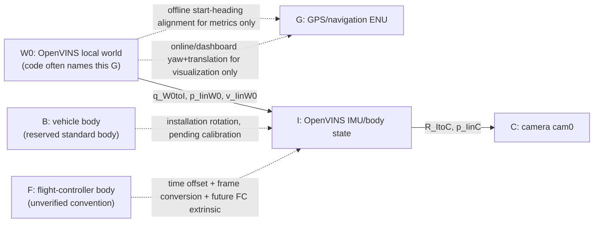

# Frame Tree Draft (Superseded Audit History)

Date: 2026-07-08

This is the first-round frame sketch. Normative names and formulas now live in
`FRAME_CONTRACT.md`. It should be rendered to `FRAME_TREE.png` only after the
`T_cam_imu` / `T_imu_cam` direction audit is closed.



## Transform Chain To Audit

```text
FC init CSV / dynamic initializer
  -> State::_imu(q_W0toI, p_IinW0, v_IinW0, bg, ba)
  -> camera/IMU extrinsic if comparing C instead of I
  -> ros-free raw traj.txt and traj.txt.bias
  -> optional dashboard XY yaw+translation visualization
  -> analysis/full_flight_error_analysis.py start-heading alignment
  -> plots, metrics, tables
```

## Red Lines

- Do not identify `W0` with GPS `G` unless the mapping row is explicit.
- Do not compare `p_IinW0` to a camera, FC, or GPS antenna position without the correct lever arm.
- Do not apply dashboard alignment and analysis alignment to the same stored data as if both were raw estimator output.
- Do not convert the observed 7 degree Euler difference into a fixed installation angle until time offset and coordinate convention are separately validated.
